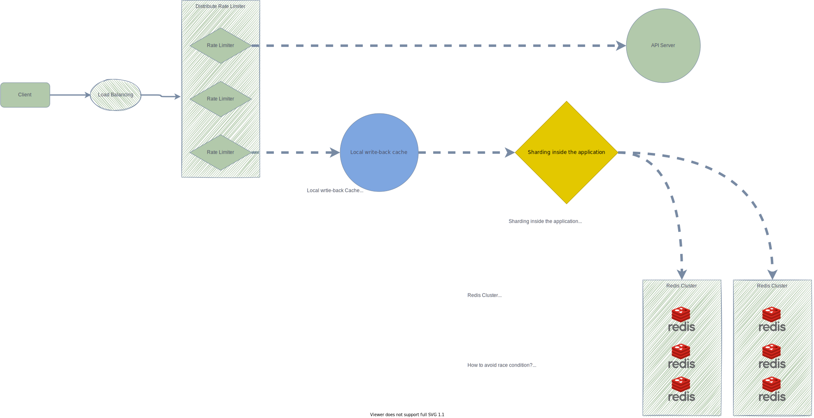

# Expecto partronum

How to design a magical rate limiter?

## Why we need rate limiter?

* Prevent Dos
* Reduce cost
* Prevent server from being overloaded

## Requirements
* Accurately limit excessive requests
* Low latency
* Little memory
* Distributed rate limiting
* Exception handling
* High fault toleranc
* Request amount

## Problems

### Where should the rate limiter be implemented?

* API gateway
* Server Side

#### Tradeoff

* Coupling to system?
* Full control of rate limit algorithms
* Using microservice already?
* Engineer resource
* Request amount?

### What is the rules of throttle, What is the algorithms using for rate limiting?

* Token bucket
* Leaking bucket
* Fixed window counter
* Sliding window log
* Sliding window counter

#### Tradeoff

* How hard to implement?
* Memory
* Allow burst of traffic?
* Accurate?
* Specific usecase?

### Where shall we store the counter?

* DB or In-Memory cache?

### Notification to client

* How?

### [Distributed] Race condition: How to prevent race condition?

* How?

### [Distributed] Synchronization issue: How to synchronize on multi-rate-limiter service?

* sticky sessions
* centralized data stored

## Solutions

### High Level Design

#### Redis cluster as counter storage backend

If we use the single node redis as the storage, it is not good for scaling and all the counter data will be stored on one node. So the redis will become the bottleneck of the system and single point of failure.

#### How to avoid race condition?

Redis uses the CRC16 hash function to allocate a slot for data; divide the CRC16 value by the number of slots, 16384.
By lua script, we can use redis cluster's atomic operation, just make sure commands that assign multi-keys(such as MGET or MSET), the keys must allocated in the same redis's slot.
We will talk more about redis data struct later.

#### Local write-back caching

But even the redis is cluster mode, the rate limiter requires one access to redis per API request which inevitably increases the total latency.

Redis is one of the fastest storage available but we need to take network round-trip time into the user numbers. If our system have $100000$ usersand single user's RPS is $5$, the request per second is $500000$.

So to avoid that, we use write-back cache in the local instance.  Read && write to local cache only. Then sync to external cache at the fixed interval(once per second).

#### Sharding inside the application

Using consistent hashing basic on userID can distribute the user's data to different redis cluster. Or shard by IP or API path.

### Low Level design

#### Algorithm: **Sliding window counter**

In **Fix window counters** algorithm, we limit the request in the fix time window, like 2 requests/min. But there is a disadvantage in fix window counter: There maybe twice the number of allowed requests per time window.

In **Sliding window log** algorithm, we just stores a timestamp for each request. As [Peter Hayes describes](https://engineering.classdojo.com/blog/2015/02/06/rolling-rate-limiter/), we could  efficiently track all of a user's requests in a redis's single sorted set.

This wasn't ideal for application with million of users, if each user have 300 requests per day. This will take too much memory for storing user's requests.

So we choose the **Sliding-window-counter** which include the advantage from both and it's not too hard to implement.

When receive a new request, Sliding window counter use multiple small fixed time windows, like 1/50th the size of fix window counter's time window, calculate the sum all all counter in past time window size.
To reduce the memory footprint, we can store our counter in a redis hash - they offer [extramely efficient storage when they have fewer then 100 keys](https://redis.io/topics/memory-optimization). When request increment a counter in the hash, it also sets the hash to expire after time window size later.

#### HTTP

* If request is rate limited
    * Return `HTTP-429(too many requests)`
* HTTP headers
    * `X-Ratelimit-Remaining`: The remaining number of allow requests within the window.
    * `X-Ratelimit-Limit`: How many calls the client can make per time window.
    * `X-Ratelimit-Retry-After`: The number of second to wait until you can make a request again without being throttled.

## Sources

[System Design — Rate limiter and Data modelling](https://medium.com/@saisandeepmopuri/system-design-rate-limiter-and-data-modelling-9304b0d18250)

[Better Rate Limiting With Redis Sorted Sets
](https://engineering.classdojo.com/blog/2015/02/06/rolling-rate-limiter/)

[Redis Basic Rate limiting](https://redis.com/redis-best-practices/basic-rate-limiting/)
[Github rate limiter with redis](https://github.blog/2021-04-05-how-we-scaled-github-api-sharded-replicated-rate-limiter-redis/)

[How redis cluster work](https://iter01.com/571560.html)
https://github.com/gitgik/distributed-system-design/blob/master/designing_api_rate_limiter.md

[Redis Lua script for atomic operations and cache stampede](https://engineering.linecorp.com/en/blog/redis-lua-scripting-atomic-processing-cache/)
[An alternative approach to rate limiting](https://www.figma.com/blog/an-alternative-approach-to-rate-limiting/)

